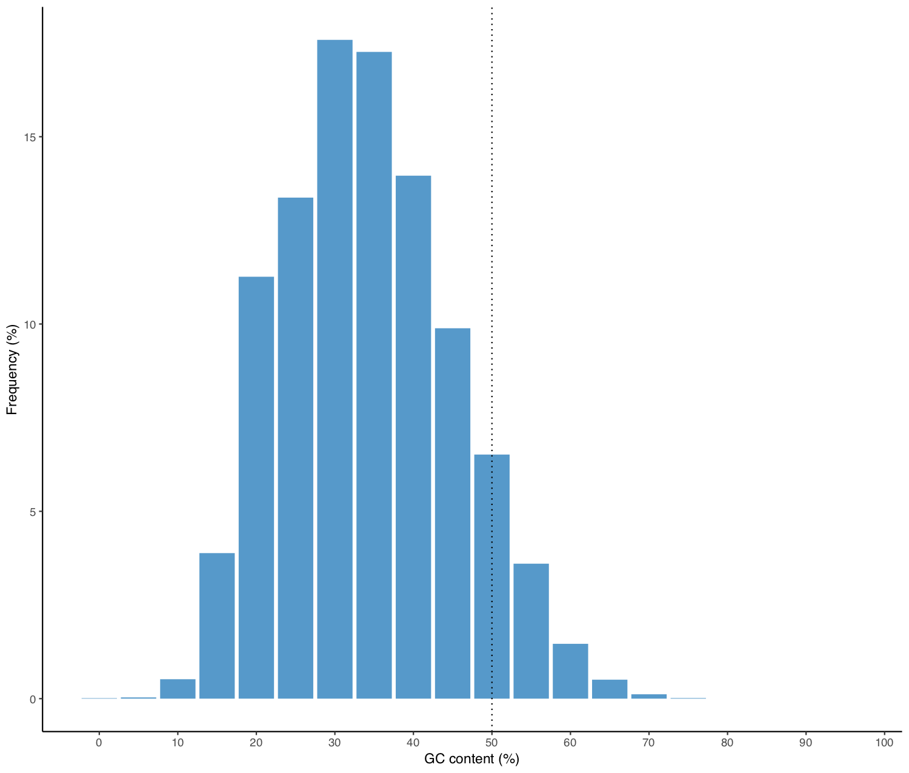
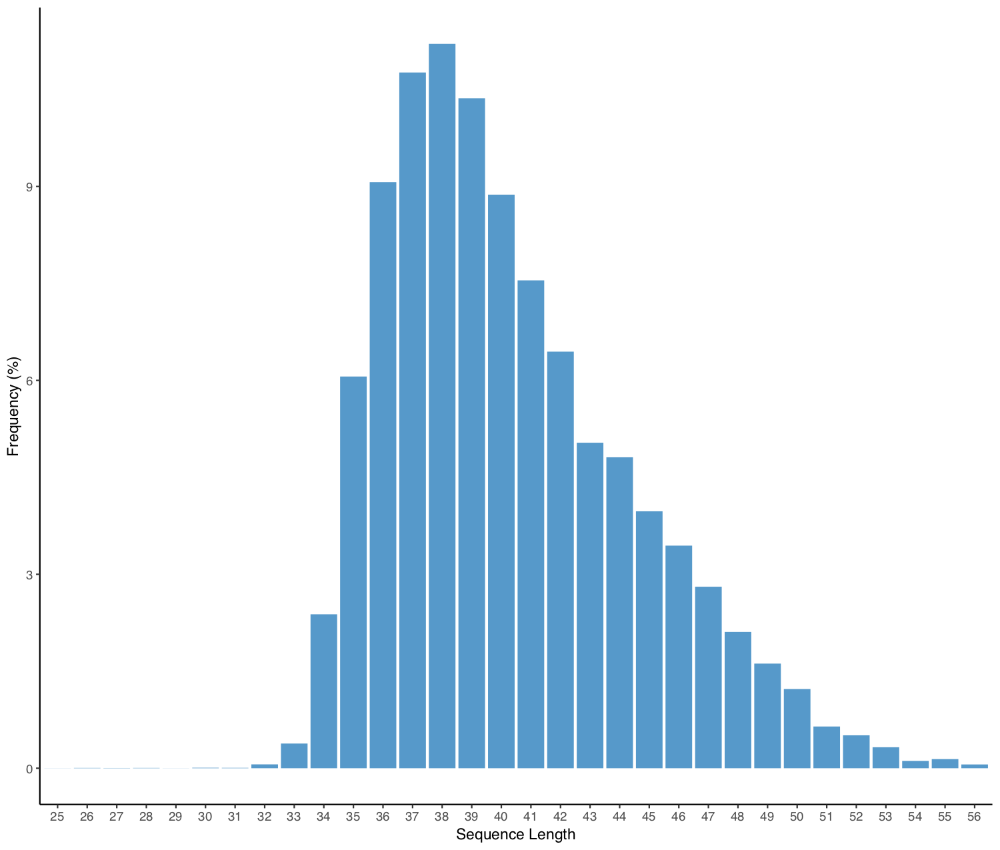

# R Scripts:

## transcriptionalBias.R

This script plots a "transcriptional bias" plot for test counts file(s) based on a counts reference file: meaning, it orders genes based on expression levels in the reference file, and then plots a cumulative sum plot for expression in test file(s) based on this gene order. This helps visualize if the test file has a similar trend in transcription as the reference file. 

NOTE: This script assumes that your output file is created using featurecounts and has the first row (description of featurecounts run) removed. For other alignment counters, change the format to match featurecounts.

Usage:
1. Download/clone the script to your preferred directory (`download_directory`)
2. Open an R console and type:\
`source('download_directory/transcriptionalBias.R')`
3. Run the transcriptional bias function using:\
`transcriptionalBias <- function(ReferenceCountsPath, TestCountsDirectory, pattern, OutputPath)`\
where the options are as follows:
```
ReferenceCountsPath	path to reference counts file (.txt)
TestCountsDirectory	path to directory with test count file(s) are stored
pattern			suffix pattern for test counts file(s) - this must be the same for all test file 
OutputPath		path to store output files
```
This creates transcriptional bias plots for each test file - one plot with the mean expression levels for all replicates, and separate plots for each replicate.
In addition to this, it also creates a single plot with mean transcriptional bias plots superimposed for all test files for comparison.

### To Do:
* Add correlation plots for test files vs reference

## seqStatsPlotR.R
This script takes in fasta files from an input directory and plots GC and sequence length distributions for each of the files, as well as total average GC and sequence length distribution for all files to the output directory.

Usage:
1. Download/clone the script to your preferred directory (`download_directory`)
2. Open an R console and type:\
`source('download_directory/seqStatsPlotR.R')`
3. Run the seqStatsPlotR using:\
`seqStatsPlotR(input_path, output_path)`


| example GC content plot | Example sequence length plot |
|---|---|
| |  |

